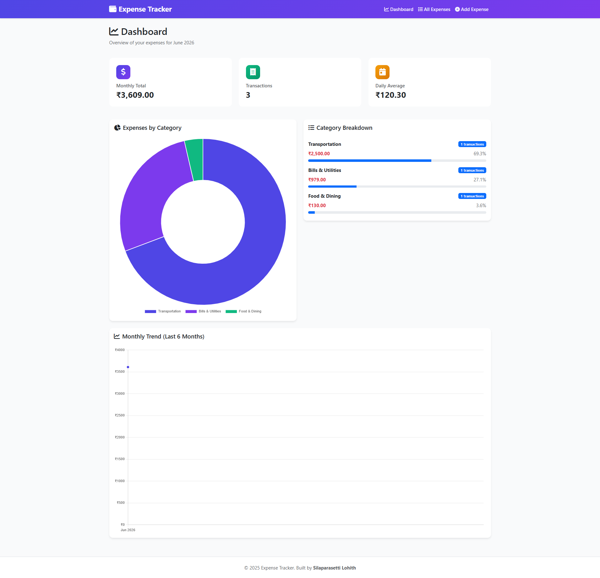
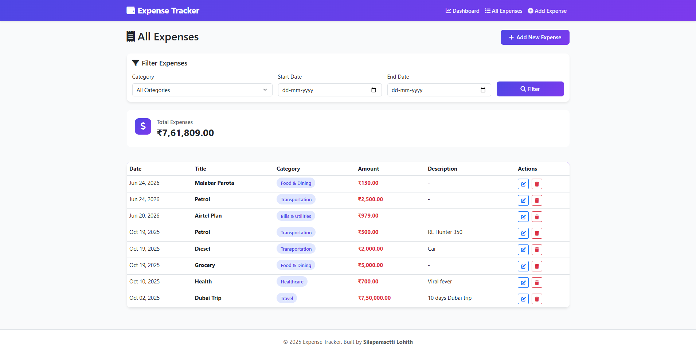
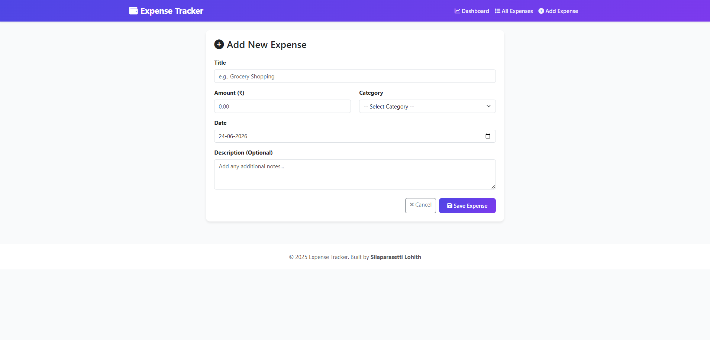

# 💰 Expense Tracker

A modern, full-featured expense tracking application built with **ASP.NET Core 10.0 MVC** and **SQLite**. Track your daily expenses, visualize spending patterns with interactive charts, and manage your finances efficiently.


## ✨ Features

- ✅ **Add, Edit, Delete Expenses** - Complete CRUD operations
- 📊 **Interactive Dashboard** - Visualize spending with Chart.js
- 🏷️ **Category Management** - 10 predefined categories for expenses
- 🔍 **Advanced Filtering** - Filter by category, date range
- 📈 **Monthly Summary** - Track monthly expenses and trends
- 💹 **Category Breakdown** - Pie charts and percentage analysis
- 📉 **6-Month Trend Analysis** - Line charts showing spending patterns
- ✔️ **Data Validation** - Built-in form validation and error handling
- 🎨 **Modern UI** - Responsive design with Bootstrap 5
- 💾 **Local Database** - SQLite for easy, portable data storage

## 📸 Screenshots

### Dashboard


### Expense List


### Add Expense



## 🚀 Getting Started

### Prerequisites

Before you begin, ensure you have the following installed:

- [.NET 10.0 SDK](https://dotnet.microsoft.com/download/dotnet/10.0) or later
- A code editor (Visual Studio, VS Code, or Rider)
- Git (for cloning the repository)

### Installation

1. **Clone the repository**
   ```bash
   git clone https://github.com/Techietal/Expense-Tracker.git
   cd expense-tracker
   ```

2. **Navigate to the project directory**
   ```bash
   cd ExpenseTracker
   ```

3. **Restore dependencies**
   ```bash
   dotnet restore
   ```

4. **Build the project**
   ```bash
   dotnet build
   ```

5. **Run the application**
   ```bash
   dotnet run
   ```

6. **Open your browser**
   
   Navigate to:
   - HTTPS: `https://localhost:7001`
   - HTTP: `http://localhost:5001`

The database will be created automatically on first run!

## 🗄️ Database

The application uses **SQLite** as a local, file-based database:

- **Database File**: `ExpenseTracker.db` (created in project root)
- **No Installation Required**: SQLite is embedded
- **Automatic Creation**: Database and tables are created on first run
- **Portable**: Simply copy the `.db` file to backup your data

### Database Schema

```sql
Expenses
├── Id (INTEGER, Primary Key, Auto-increment)
├── Title (TEXT, Required)
├── Amount (REAL, Required)
├── Category (TEXT, Required)
├── Date (TEXT, Required)
├── Description (TEXT, Optional)
└── CreatedAt (TEXT, Auto-generated)
```

## 📁 Project Structure

```
ExpenseTracker/
├── Controllers/
│   └── ExpensesController.cs       # Handles all expense operations
├── Data/
│   └── ExpenseDbContext.cs         # Entity Framework DB Context
├── Models/
│   └── Expense.cs                  # Data models and validation
├── Views/
│   ├── Expenses/
│   │   ├── Index.cshtml            # List all expenses
│   │   ├── Create.cshtml           # Add new expense
│   │   ├── Edit.cshtml             # Edit expense
│   │   ├── Delete.cshtml           # Delete confirmation
│   │   └── Dashboard.cshtml        # Analytics dashboard
│   └── Shared/
│       ├── _Layout.cshtml          # Main layout
│       └── _ValidationScriptsPartial.cshtml
├── wwwroot/                        # Static files (CSS, JS, images)
├── Program.cs                      # Application entry point
├── appsettings.json               # Configuration
└── ExpenseTracker.csproj          # Project file
```

## 🎯 Usage

### Adding an Expense

1. Click **"Add Expense"** in the navigation menu
2. Fill in the form:
   - **Title**: Name of the expense (e.g., "Grocery Shopping")
   - **Amount**: Cost in rupees
   - **Category**: Select from predefined categories
   - **Date**: Date of expense
   - **Description**: Optional notes
3. Click **"Save Expense"**

### Viewing Dashboard

1. Navigate to **Dashboard** from the menu
2. View:
   - Monthly total expenses
   - Transaction count
   - Daily average
   - Category-wise pie chart
   - 6-month spending trend

### Filtering Expenses

1. Go to **"All Expenses"**
2. Use filters:
   - **Category**: Filter by specific category
   - **Date Range**: Select start and end dates
3. Click **"Filter"** to apply

## 🛠️ Technologies Used

- **Backend**: ASP.NET Core 10.0 MVC
- **Database**: SQLite with Entity Framework Core
- **Frontend**: 
  - HTML5, CSS3, JavaScript
  - Bootstrap 5.3
  - Font Awesome 6.4
  - Chart.js 4.3
- **ORM**: Entity Framework Core 10.0
- **Validation**: Data Annotations & jQuery Validation

## 📦 NuGet Packages

```xml
<PackageReference Include="Microsoft.EntityFrameworkCore.Sqlite" Version="10.0.9" />
<PackageReference Include="Microsoft.EntityFrameworkCore.Tools" Version="10.0.9" />
<PackageReference Include="Microsoft.EntityFrameworkCore.Design" Version="10.0.9" />
```

## 🎨 Categories

The application includes 10 predefined expense categories:

1. 🍔 Food & Dining
2. 🚗 Transportation
3. 🛍️ Shopping
4. 🎬 Entertainment
5. 💡 Bills & Utilities
6. 🏥 Healthcare
7. 📚 Education
8. ✈️ Travel
9. 💅 Personal Care
10. 📌 Others

## 🔧 Configuration

### Changing Database Location

Edit `appsettings.json`:

```json
{
  "ConnectionStrings": {
    "DefaultConnection": "Data Source=C:/MyData/ExpenseTracker.db"
  }
}
```

### Changing Port

Edit `Properties/launchSettings.json` or run:

```bash
dotnet run --urls="http://localhost:5002;https://localhost:7002"
```

## 🐛 Troubleshooting

### Database Not Created
```bash
# Delete the database file and restart
rm ExpenseTracker.db
dotnet run
```

### Port Already in Use
```bash
# Use different port
dotnet run --urls="http://localhost:5002"
```

### Build Errors
```bash
# Clean and rebuild
dotnet clean
dotnet restore
dotnet build
```

### Package Restore Issues
```bash
# Clear NuGet cache
dotnet nuget locals all --clear
dotnet restore
```

## 📊 Features in Detail

### LINQ Queries Implementation

The application demonstrates various LINQ operations:

```csharp
// Filtering by category
var filtered = expenses.Where(e => e.Category == selectedCategory);

// Date range filtering
var rangeExpenses = expenses.Where(e => e.Date >= startDate && e.Date <= endDate);

// Grouping by category
var grouped = expenses.GroupBy(e => e.Category)
                     .Select(g => new { 
                         Category = g.Key, 
                         Total = g.Sum(e => e.Amount) 
                     });

// Monthly aggregation
var monthly = expenses.GroupBy(e => new { e.Date.Year, e.Date.Month })
                     .Select(g => new { 
                         Month = new DateTime(g.Key.Year, g.Key.Month, 1),
                         Total = g.Sum(e => e.Amount) 
                     });
```

### Data Validation

Built-in validation attributes:

- `[Required]` - Ensures field is not empty
- `[Range]` - Validates numeric ranges
- `[StringLength]` - Limits text length
- `[DataType]` - Specifies data format

## 🚀 Deployment

### Publish for Production

```bash
# Windows
dotnet publish -c Release -r win-x64 --self-contained

# Linux
dotnet publish -c Release -r linux-x64 --self-contained

# macOS
dotnet publish -c Release -r osx-x64 --self-contained
```

Published files will be in `bin/Release/net10.0/{runtime}/publish/`

## 🤝 Contributing

Contributions are welcome! Please follow these steps:

1. Fork the repository
2. Create a feature branch (`git checkout -b feature/AmazingFeature`)
3. Commit your changes (`git commit -m 'Add some AmazingFeature'`)
4. Push to the branch (`git push origin feature/AmazingFeature`)
5. Open a Pull Request

## 📝 License

This project is licensed under the MIT License - see the [LICENSE](LICENSE) file for details.

## 👨‍💻 Author

Silaparasetti Lohith
- GitHub: [@Techietal](https://github.com/Techietal)
- Email: lohith.its@gmail.com

## 🙏 Acknowledgments

- Built with [ASP.NET Core](https://dotnet.microsoft.com/apps/aspnet)
- Charts powered by [Chart.js](https://www.chartjs.org/)
- UI components from [Bootstrap](https://getbootstrap.com/)
- Icons by [Font Awesome](https://fontawesome.com/)

## 📧 Support

If you encounter any issues or have questions:

1. Check the [Issues](https://github.com/Techietal/Expense-Tracker/issues) page
2. Create a new issue with detailed description
3. Contact: lohith.its@gmail.com

---

⭐ **Star this repo** if you find it helpful!

Made by Silaparasetti Lohith
